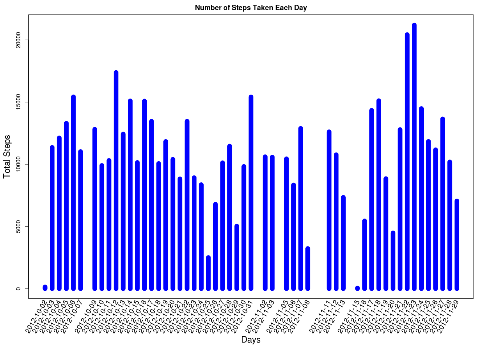
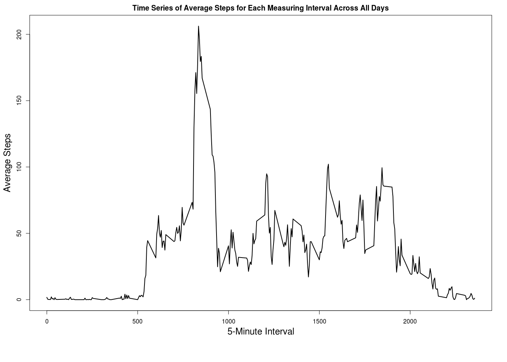
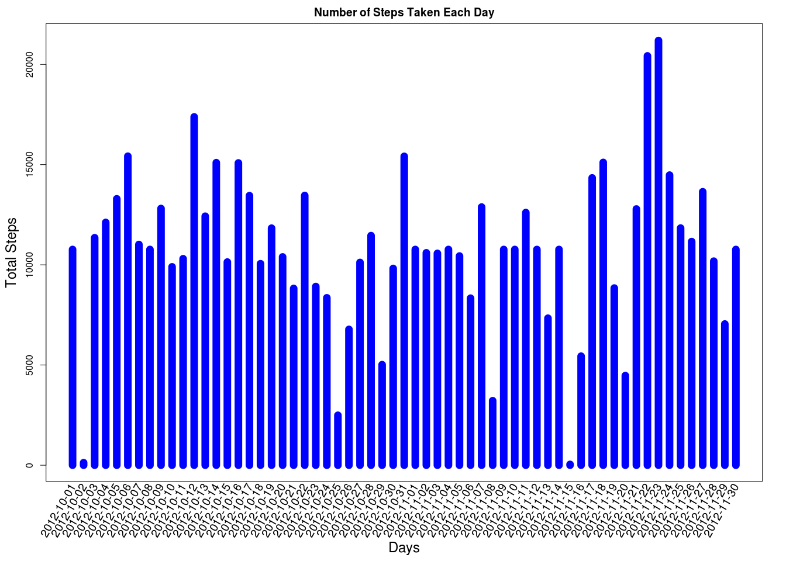
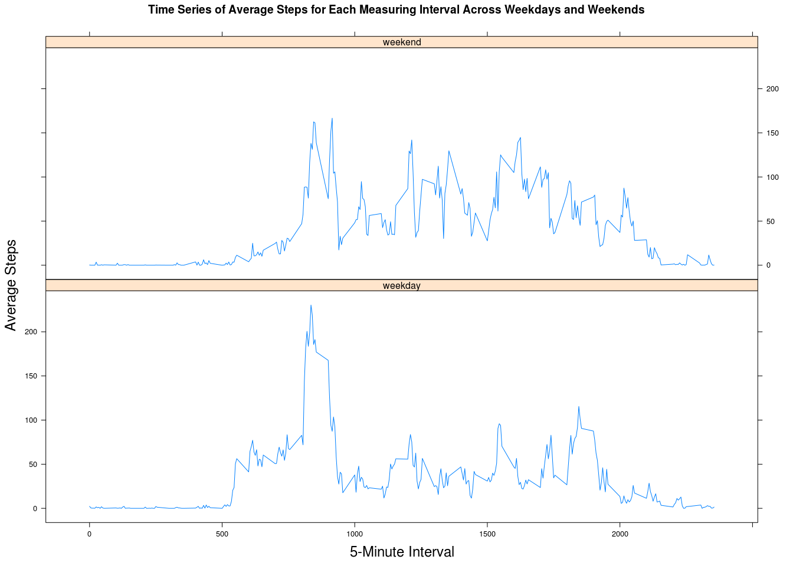

# Reproducible Research: Peer Assessment 1


## Loading and preprocessing the data

```r
# Necessary libraries 
library(data.table)
library(ggplot2)
library(dtplyr)
library(lattice)

# reading data 
personalMovement <- fread("activity.csv")
# Coersing string characters of Date collumn to objects from class Date
personalMovement$date <- as.Date(personalMovement$date)
# Coersing integers values of steps collumn to numeric
personalMovement$steps <- as.numeric(personalMovement$steps)

summary(personalMovement)
```

```
##      steps             date               interval     
##  Min.   :  0.00   Min.   :2012-10-01   Min.   :   0.0  
##  1st Qu.:  0.00   1st Qu.:2012-10-16   1st Qu.: 588.8  
##  Median :  0.00   Median :2012-10-31   Median :1177.5  
##  Mean   : 37.38   Mean   :2012-10-31   Mean   :1177.5  
##  3rd Qu.: 12.00   3rd Qu.:2012-11-15   3rd Qu.:1766.2  
##  Max.   :806.00   Max.   :2012-11-30   Max.   :2355.0  
##  NA's   :2304
```

## What is mean total number of steps taken per day?
For this part of the assignment, you can ignore the missing values in the dataset.

1. Make a histogram of the total number of steps taken each day


```r
stepsPerDay <- aggregate(steps ~ date, data = personalMovement, sum)
stepsPerDay$steps <- as.numeric(stepsPerDay$steps)
par(mar = c(7.1,4.1,2.1,2.1))
plot(stepsPerDay$date, stepsPerDay$steps, type="h", col=("blue"), lwd=13, main="Number of Steps Taken Each Day", ylab="", xlab = "", xaxt = "n")
title(ylab="Total Steps", line=2.5, cex.lab=1.5)
title(xlab="Days", line=5.5, cex.lab=1.5)
text(stepsPerDay$date, par("usr")[3]-150, srt = 60, adj= 1, xpd = TRUE, labels = stepsPerDay$date, cex=1.25)
```

<!-- -->

2. Calculate and report the **mean** and **median** total number of steps taken per day


```r
meansteps <- mean(stepsPerDay$steps)
mediansteps <- median(stepsPerDay$steps)
```

        These are the mean = 10766.1887 and the median = 10765 values.

## What is the average daily activity pattern?

1. Make a time series plot (i.e. `type = "l"`) of the 5-minute interval (x-axis) and the average number of steps taken, averaged across all days (y-axis)


```r
stepsPerInterval <- aggregate(steps ~ interval, data = personalMovement, mean)
par(mar = c(7.1,4.1,2.1,2.1))
plot(stepsPerInterval$interval, stepsPerInterval$steps, type="l", lwd=2, main="Time Series of Average Steps for Each Measuring Interval Across All Days", ylab="", xlab = "")
title(ylab="Average Steps", line=2.5, cex.lab=1.5)
title(xlab="5-Minute Interval", line=2.5, cex.lab=1.5)
```

<!-- -->

2. Which 5-minute interval, on average across all the days in the dataset, contains the maximum number of steps?


```r
maxStepInterval <- subset(stepsPerInterval, stepsPerInterval$steps == max(stepsPerInterval$steps))
```

        The interval 835 has the maximum average steps (206.169811) across measured days. 

## Imputing missing values
1. Calculate and report the total number of missing values in the dataset (i.e. the total number of rows with `NA`s)


```r
nas <- sum(is.na(personalMovement))
```

        The total number of rows with NA's is 2304.

2. Devise a strategy for filling in all of the missing values in the dataset. The strategy does not need to be sophisticated. For example, you could use the mean/median for that day, or the mean for that 5-minute interval, etc.


```r
nasRows <- is.na(personalMovement$steps)
# Populate missing values with the mean for that 5-minute interval
personalMovement2 <- personalMovement
personalMovement2[nasRows,]$steps <- stepsPerInterval[match(personalMovement[nasRows,]$interval, stepsPerInterval$interval),]$steps
```

3. Create a new dataset that is equal to the original dataset but with the missing data filled in.


```r
summary(personalMovement2)
```

```
##      steps             date               interval     
##  Min.   :  0.00   Min.   :2012-10-01   Min.   :   0.0  
##  1st Qu.:  0.00   1st Qu.:2012-10-16   1st Qu.: 588.8  
##  Median :  0.00   Median :2012-10-31   Median :1177.5  
##  Mean   : 37.38   Mean   :2012-10-31   Mean   :1177.5  
##  3rd Qu.: 27.00   3rd Qu.:2012-11-15   3rd Qu.:1766.2  
##  Max.   :806.00   Max.   :2012-11-30   Max.   :2355.0
```

4. Make a histogram of the total number of steps taken each day and Calculate and report the **mean** and **median** total number of steps taken per day. Do these values differ from the estimates from the first part of the assignment? What is the impact of imputing missing data on the estimates of the total daily number of steps?


```r
stepsPerDay <- aggregate(steps ~ date, data = personalMovement2, sum)
stepsPerDay$steps <- as.numeric(stepsPerDay$steps)
par(mar = c(7.1,4.1,2.1,2.1))
plot(stepsPerDay$date, stepsPerDay$steps, type="h", col=("blue"), lwd=13, main="Number of Steps Taken Each Day", ylab="", xlab = "", xaxt = "n")
title(ylab="Total Steps", line=2.5, cex.lab=1.5)
title(xlab="Days", line=5.5, cex.lab=1.5)
text(stepsPerDay$date, par("usr")[3]-150, srt = 60, adj= 1, xpd = TRUE, labels = stepsPerDay$date, cex=1.25)
```

<!-- -->

```r
meansteps <- mean(stepsPerDay$steps)
mediansteps <- median(stepsPerDay$steps)
```

        These are the mean = 10766.1887 and the median = 10766.1887 values.

The added missing values has change the graph of Number of Steps Taken Each Day. Some histogram bins have been included into the graph which the mean value for Steps  per interval acroos all days. The added values had no impact in the computed mean and a minimum impact in the computed median. 

## Are there differences in activity patterns between weekdays and weekends?

1. Create a new factor variable in the dataset with two levels -- "weekday" and "weekend" indicating whether a given date is a weekday or weekend day.


```r
# Setting to US system local time to get weeksdays in english 
Sys.setlocale("LC_TIME", "en_US.UTF-8")
```

```
## [1] "en_US.UTF-8"
```

```r
#  Create a factor-collum with weeksdays names for respective dates
personalMovement2$week_factor <- as.factor(weekdays(personalMovement2$date))
#  Adjust factor levels to be one of: weekday or weekend
levels(personalMovement2$week_factor) <- list(weekday = c("Monday", "Tuesday", "Wednesday", "Thursday", "Friday"), weekend = c("Saturday", "Sunday"))
summary(personalMovement2$week_factor)
```

```
## weekday weekend 
##   12960    4608
```

2. Make a panel plot containing a time series plot (i.e. `type = "l"`) of the 5-minute interval (x-axis) and the average number of steps taken, averaged across all weekday days or weekend days (y-axis).


```r
stepsPerWeekFactor <- aggregate(steps ~ week_factor + interval, data = personalMovement2, mean)
xyplot(stepsPerWeekFactor$steps ~ stepsPerWeekFactor$interval | stepsPerWeekFactor$week_factor, layout = c(1, 2), type = "l",
main = "Time Series of Average Steps for Each Measuring Interval Across Weekdays and Weekends",
ylab = list(label = "Average Steps", cex = 1.5), xlab = list(label = "5-Minute Interval", cex = 1.5))
```

<!-- -->
